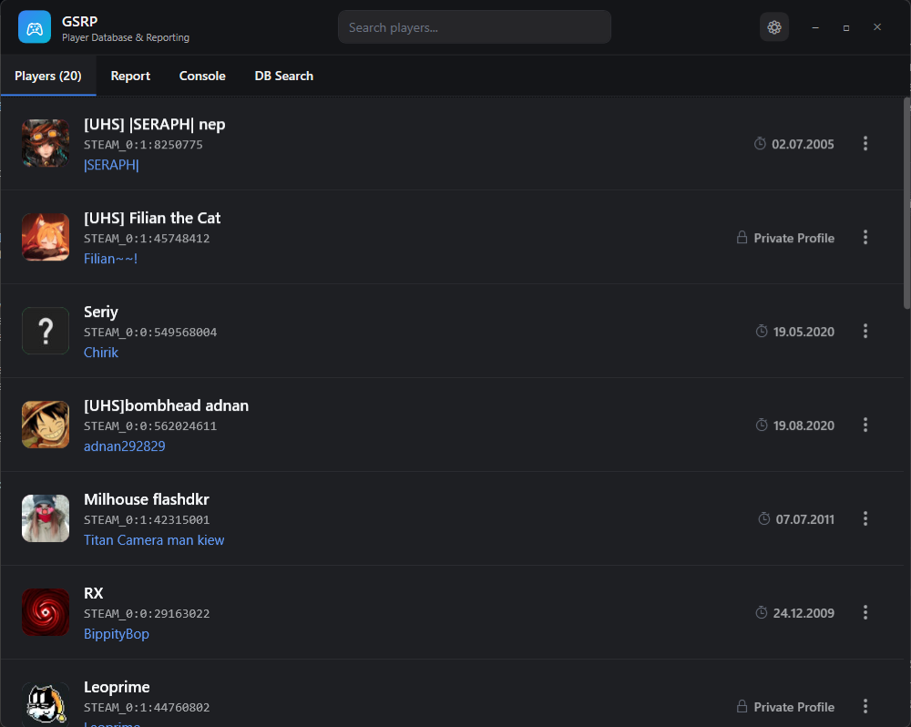

# GSRP - Player Database & Reporting

This is your "smart" player table (it is currently **Windows** only, the "Preview" release speaks for itself). GSRP is a specialized desktop application designed to act as a "smart TAB button". Its primary function is to quickly identify players from copied game console output (e.g., `status` command), providing immediate, relevant information without needing to access friends lists or remember complex IDs. It offers a clean, beautiful output for on-the-fly player identification.

## Important Notes

⚠️ A [Steam WEB API key](https://steamcommunity.com/dev/apikey) and a mobile authenticator are required for full functionality. Without them, only the cache and the local database will be available. I plan to improve secure storage of the API key later, since **the theft of the API key can lead to account compromise**.

I recommend creating a separate alternate Steam account and using that account for any workflows that require the API key or a linked authenticator. This avoids exposing your main account — the API key is a single weak point, so protect the account tied to it. One simple approach: create an alt, install Steam in an android emulator, and link the alt to your mobile authenticator. That way your primary account and its data aren't at risk. (Settings > Add API Key)

**Note:** The risk of API key theft mainly applies if someone has physical access to your computer or account. Stored data is encrypted and will not work on another machine because it is protected with DPAPI.

## Features

*   **Quick Player Identification from Clipboard:** The core feature. Copy game console output (like a `status` command result), and GSRP will parse it to provide instant, enriched player details.
*   **Smart Steam API Integration:** Enriches profiles with data from Steam. Player data is cached for 20 minutes and avatars are cached permanently by hash to respect API rate limits and improve performance.
*   **Manual Profile Refresh:** Manually update any player's VAC status and profile information (avatar, name) directly from their card's context menu.
*   **Shareable Player Cards:** Generate a clean image of a player's card with their key information to easily share reports or findings.
*   **Customizable Player Icons:** Assign custom icons to players for easy identification.
*   **Color-Coded Nicknames:** Assign custom colors to player names, Steam names, and aliases for better visual organization.
*   **Local Data Storage:** Utilizes a local SQLite database for persistent storage of player data and settings.
*   **Offline Mode Support:** Designed to function with available local data even without an active internet connection or Steam API key.
*   **One‑click Report:** Quickly generate a formatted report (server, player, nick, IDs, reason) suitable for sending to server administrators — intended for any player to use when reporting incidents on a server, not only for community managers or admins.

## Usage

### Players Tab

This tab shows players added during the current session. To add players, run the `status` command in-game and copy the console output. Right-click a player avatar to open the icon menu; right-click elsewhere on the card for the context menu. You can also right-click the '...' menu on a card to manually refresh that player's data.

*   **Alias:** You can assign an Alias to a player (a custom label, e.g., player "ej mentol" → Alias "nanaga nub").

### Report Tab

This tab helps generate a report for GS by filling a template with the selected values. For convenience, use "Copy to Report" from the player card context menu.

*   **Specialized Use:** This feature is designed to produce a one-click formatted report (server, who, nick, ids, reason) that any player can use to quickly alert server administrators.

### Console Tab

This tab is designed for use with the MetahookSV ChatForwarder plugin. It provides a simple way to view real-time in-game chat via UDP.

*   **Warning:** This plugin currently does NOT track server connection state. Sending messages to the game port via this plugin can be unstable and potentially crash the game. Use with extreme caution.

### DB Search Tab

This is a basic tool to find players in the database. It accepts:

*   **Steam Usernames:** Searches the database for players by their last known Steam Name (PersonaName). In-game names from the 'status' command are not stored.
*   **SteamID64:** (Starts with `765...`)
*   **SteamID2:** (e.g., `STEAM_X:Y:ZZZZZZ`)

Functionality matches the Players tab. You can change the displayed name color or assign an icon. `Player Name = Steam Name`

## Getting Started

### Prerequisites

To build and run GSRP, you will need:

*   [.NET 8 SDK](https://dotnet.microsoft.com/download/dotnet/8) (for building from source). For running the application, the [.NET 8 Runtime](https://dotnet.microsoft.com/download/dotnet/8) may be required.
*   **Steam Web API Key:** A valid Steam Web API Key is required for Steam API integration features. You can obtain one [here](https://steamcommunity.com/dev/apikey).

### Building from Source

1.  Clone the repository:
    ```bash
    git clone https://github.com/your-username/GSRP.git
    cd GSRP
    ```
2.  Build the project:
    ```bash
    dotnet build
    ```

### Running the Application

After building, you can find the executable in the `bin/Debug/net8.0-windows/` (or `bin/Release/net8.0-windows/`) directory within your project folder. Simply run the `GSRP.exe` file.

### Pre-populated Database

For convenience, a pre-populated SQLite database (`players.db`) containing approximately 16,000 player entries will be provided in a `GSRP_content.rar` archive.

1.  Download the `GSRP_content.rar` archive (link to be provided in release).
2.  Extract the contents of `GSRP_content.rar` to your AppData Roaming folder. The `players.db` file should end up in:
    `%APPDATA%\GSRP\` or `C:\Users\%username%\AppData\Roaming\GSRP\`



## License

This project is licensed under the MIT License - see the [LICENSE](LICENSE) file for details.
